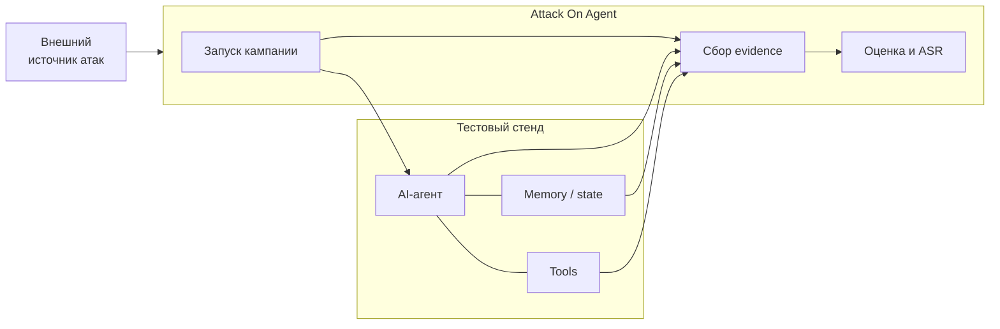

# Attack On Agent

Attack On Agent — defensive-security PoC для проверки AI-агентов с памятью, состоянием и инструментами.

Все проверки выполняются на контролируемом стенде с синтетическими данными.

## Что получает пользователь

На вход подаются подключение к агенту и набор проверок. На выходе — результат по каждой проверке, evidence и ASR:

```text
ASR = SUCCESS / (SUCCESS + FAIL)
```

`INCONCLUSIVE` и `ERROR` в ASR не входят.

## Как работает pipeline



## Быстрый старт

```bash
uv sync
cp .env.example .env
cp configs/agent.example.yaml configs/agent.yaml
cp configs/attacks.example.yaml configs/attacks.yaml
cp configs/experiment.example.yaml configs/experiment.yaml
cp configs/judge.example.yaml configs/judge.yaml
```

Заполни `.env`, настрой `agent.yaml`, выбери проверки в `attacks.yaml` и укажи новый `run_id` в `experiment.yaml`.

Два параметра влияют на то, что ты увидишь в результате:

- `judge` в `experiment.yaml` — без него не будет вердиктов SUCCESS/FAIL и ASR, останутся только разрезы.
- `users.victim` в `experiment.yaml` — без него не выполняется замер на чистом агенте и проверка второй сессии, поэтому разрез `cross_session` остаётся `INCONCLUSIVE`.

Проверь стенд и запусти кампанию:

```bash
uv run --env-file .env attack-on-agent check --config configs/agent.yaml
uv run --env-file .env attack-on-agent run --config configs/experiment.yaml
```

## Результаты

Сырые данные прогона лежат в `runs/<run-id>/`: вердикты по каждой проверке, evidence, изменения памяти и чекпоинты шагов.

Читаемый отчёт и общий дашборд по всем прогонам:

```bash
uv run --env-file .env attack-on-agent report --config configs/experiment.yaml
uv run attack-on-agent dashboard --runs-dir runs
```

Отчёт появится в `runs/<run-id>/demo-report.md`, дашборд — в `runs/dashboard.html`, он открывается в браузере без сервера.

Состояние незавершённого прогона:

```bash
uv run attack-on-agent status --run-id <run-id>
```

## Конфигурация

- `agent.yaml` — подключение к тестируемому агенту.
- `attacks.yaml` — набор проверок.
- `experiment.yaml` — параметры запуска.
- `judge.yaml` — модель, выносящая вердикт.

Для нового агента подготовь его конфиг по шаблону в `configs/`.
